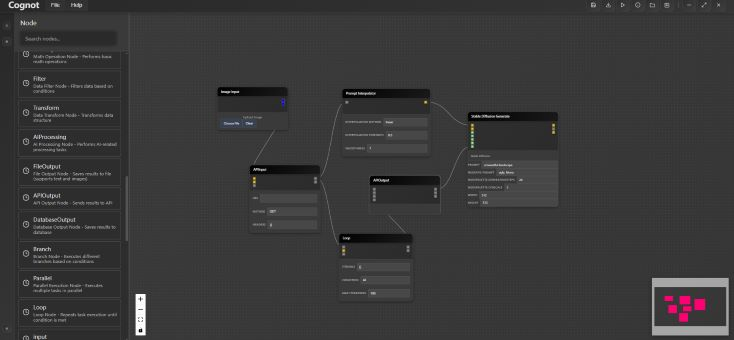

# Cognot - Advanced AI Workflow Engine

Cognot is an open-source, flexible, and extensible AI Workflow Engine focused on AI image generation and video processing. It empowers users to create, execute, and manage complex AI-driven workflows through an intuitive visual interface.



## 📢news
   
December 11, 2025 🙌: Support for HunyuanVideo and Wan 2.2 Video Models
December 08, 2025 🎠: Added Context Search Node & Optimized User Experience
December 07, 2025 🎊: Supported Import of ComfyUI-Format Workflows
December 01, 2025 ✨: Enabled GPU Acceleration for NVIDIA Graphics Cards

## Project Status
   
🚧 **Under Development** 🚧

Cognot is currently in active development. We are working diligently to implement all planned features and continuously improve the engine's stability and performance.

## System Requirements

- **Python**: 3.8+
- **Node.js**: 16+
- **npm**: 8+
- **Operating System**: Windows, macOS, Linux

## Key Features & Advantages

### 🎨 AI Image Generation
- **Stable Diffusion Integration**: Generate images from text prompts using Stable Diffusion models
- **Image-to-Image Transformation**: Convert images based on text prompts with precise control
- **Advanced Parameter Control**: Multiple samplers, resolution options, and configuration settings
- **Custom Model Support**: Load and use your preferred models for specialized results

### 🎬 AI Video Processing
- **Comprehensive Video Handling**: Load and process various video formats
- **Frame-by-Frame Analysis**: Extract and analyze individual video frames
- **Optical Flow Calculation**: Advanced motion analysis for smooth video transformations
- **Wan2.2 Integration**: Leverage powerful video processing capabilities

### 🛠️ Workflow Management
- **Visual Drag-and-Drop Designer**: Intuitive interface for creating complex workflows
- **Real-time Execution Monitoring**: Track progress and performance visually
- **Import/Export Functionality**: Share and reuse workflows across projects
- **Version Control**: Manage workflow versions and history

### 🔧 Node Ecosystem
- **Extensible Architecture**: Easily create and integrate custom nodes
- **Built-in AI Task Nodes**: Ready-to-use nodes for common AI operations
- **ComfyUI Adapter**: Seamlessly use nodes from the ComfyUI ecosystem
- **Type Safety**: Advanced type checking for reliable node connections
- **Cross-Platform Compatibility**: Consistent behavior across operating systems

### ⚡ Execution Engine
- **Parallel Execution**: Optimize performance with parallel branch execution
- **Smart Queue Management**: Efficient resource utilization and task scheduling
- **Robust Error Handling**: Comprehensive error recovery mechanisms
- **Detailed Logging**: Debug and monitor with extensive execution logs

### 🎨 Modern UI/UX
- **Responsive Web Interface**: Access from any modern browser
- **Dark/Light Theme Support**: Comfortable viewing in any environment
- **Intuitive Node Panel**: Search and filter nodes with ease
- **Real-time Visualization**: Dynamic workflow progress tracking

## System Architecture

Cognot adopts a layered architecture designed for flexibility, scalability, and ease of extension:

### Core Engine Layer
- **Graph Parser**: Converts workflow definitions into executable graphs
- **Execution Engine**: Manages workflow execution, node scheduling, and resource allocation
- **Node Registry**: Central repository for node definitions and implementations
- **Type System**: Ensures type safety and compatibility between nodes

### Service Layer
- **API Gateway**: RESTful endpoints for workflow management
- **WebSocket Service**: Real-time communication between client and server
- **File Service**: File upload/download and storage management
- **Configuration Service**: Application settings and configuration management

### User Interface Layer
- **React Frontend**: Modern web interface built with Vite
- **Context Providers**: Global state and application context management
- **Component Library**: Reusable UI components for workflow design and management

## Quick Start

### Installation

#### Backend Setup

1. Clone the repository:
   ```bash
   git clone https://github.com/CognotEngine/cognot.git
   cd cognot
   ```

2. Create and activate a virtual environment:
   ```bash
   # Windows
   python -m venv venv
   venv\Scripts\activate
   
   # macOS/Linux
   python3 -m venv venv
   source venv/bin/activate
   ```

3. Install dependencies:
   ```bash
   pip install -r requirements.txt
   ```

#### Frontend Setup

1. Navigate to the frontend directory:
   ```bash
   cd frontend
   ```

2. Install dependencies:
   ```bash
   npm install
   ```

### Running the Application

#### Start the Backend Server
```bash
# From project root directory
python api/gateway/main.py
```
Backend API will be available at `http://localhost:8000`

#### Start the Frontend Development Server
```bash
# From frontend directory
npm run dev
```
Frontend application will be available at the URL shown in the terminal output (typically `http://localhost:3000`)

#### Access the System
Open your web browser and navigate to the frontend URL to start creating and executing workflows!

## Development Guide

### Backend Development
- Core engine code is located in the `core/` directory
- API endpoints are defined in `api/gateway/main.py`
- Add new node types by creating new files in `core/` and registering them with the `@register_node` decorator

### Frontend Development
- React application code is in `frontend/src/`
- Components are organized in `frontend/src/components/`
- Context providers are located in `frontend/src/contexts/`
- Run frontend in development mode:
  ```bash
  npm run dev
  ```
- Build for production:
  ```bash
  npm run build
  ```

## ComfyUI Integration

Cognot features deep integration with ComfyUI, allowing seamless use of the extensive ComfyUI node ecosystem:

- **Automatic Node Conversion**: Convert ComfyUI nodes to Cognot-compatible format automatically
- **Type System Mapping**: Ensure type safety between different node systems
- **Metadata Synchronization**: Maintain consistent node descriptions and properties
- **Seamless Execution**: Use converted nodes directly in Cognot workflows

### Example Workflow
1. **CheckpointLoaderSimple**: Load a Stable Diffusion model
2. **CLIPTextEncode**: Encode text prompt into CLIP embeddings
3. **KSampler**: Generate latent space representation
4. **VAEDecode**: Decode into final image

## Project Structure

```
Cognot/
├── api/                    # Backend API implementation
│   ├── gateway/            # API gateway and endpoints
│   └── endpoints/          # API endpoints
├── config/                 # Configuration files
├── core/                   # Core engine implementation
│   ├── base_node.py        # Node base class
│   ├── node_registry.py    # Node registry
│   ├── stable_diffusion_nodes.py  # AI image generation nodes
│   ├── video_processing_nodes.py  # Video processing nodes
│   ├── comfyui_adapter.py  # ComfyUI node adapter
│   ├── comfyui_executor.py # ComfyUI execution engine
│   └── comfyui_model_manager.py # ComfyUI model manager
├── frontend/               # React frontend application
├── tests/                  # Test files
├── requirements.txt        # Python dependencies
├── setup.py                # Package installation configuration
└── README.md               # Project documentation
```

## GPU Support

Cognot supports GPU acceleration for AI model nodes on systems with compatible NVIDIA GPUs:

1. Ensure latest NVIDIA drivers are installed
2. Install CUDA and cuDNN (if required by AI models)
3. The system will automatically detect and use available GPUs for AI tasks

## Why Choose Cognot?

- **Unified Platform**: Combine image generation and video processing in one workflow
- **Extensive Integration**: Leverage both built-in nodes and ComfyUI ecosystem
- **Developer-Friendly**: Easy to extend with custom nodes and functionality
- **Performance Optimized**: Efficient execution engine with parallel processing
- **Open Source**: Community-driven development and transparency
- **User-Centric Design**: Intuitive interface for both beginners and experts

## Contributing

We highly welcome contributions from the community! If you'd like to contribute to Cognot:

1. Fork the repository
2. Create a new branch for your feature or fix
3. Make your changes and commit with descriptive messages
4. Push your changes to your fork
5. Submit a pull request

## License

Cognot is released under the MIT License. See the LICENSE file for more information.

## Contact

For questions, suggestions, or support, please open an issue on GitHub or join our development community.

---

⭐ **Star this repository** if you find Cognot useful!
